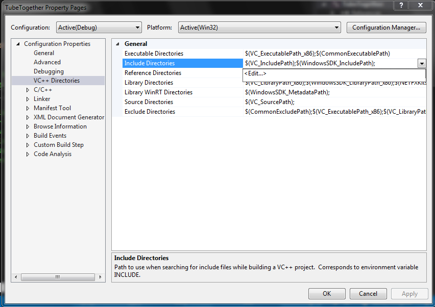
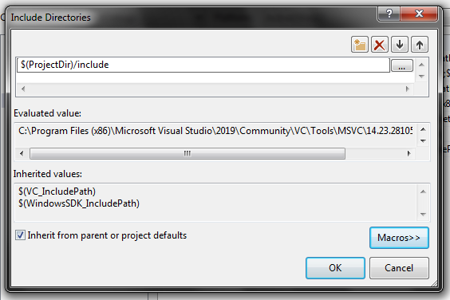

# Как запустить?

=== Сервер ===

1. Открыть папку проект вижуалки в вижуалке.
2. Настроить пути инклюдов: Проект > Свойства
3. Открыть пункт со скрина: 
4. Нажать "редактировать" в выпадающем меню как на прошлом скрине.
5. Прописать `$(ProjectDir)/include`: 
6. Сохранить изменения.
7. Скомпилировать и запустить сервер.

=== Клиент ===

8. Установить питон версии 3.7.x, например 3.7.9.
9. Выполнить команду `python --version`, чтобы убедиться что python это питон версии 3.7.x.
10. Выполнить команду `python -m pip install cefpython3 requests flask`. Она докачает нужные модули.
11. Открыть терминал
12. Перейти в папку с курсачом, затем в папку client.
13. Выполнить команду `python main.py` чтобы запустить клиент.
14. Повторить шаги 6-8 чтобы запустить второй клиент.
15. В одном клиенте ввести логин: man, пароль: boy.
16. На втором клиенте ввести логин: hello, пароль: world.
17. Начать игру на двух клиентах.